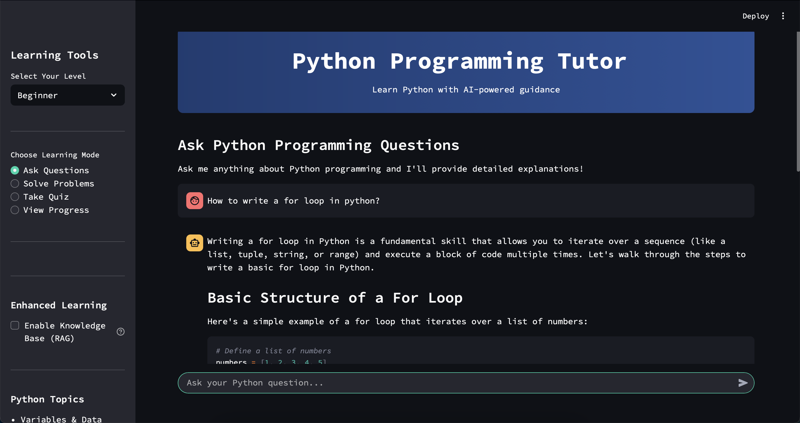
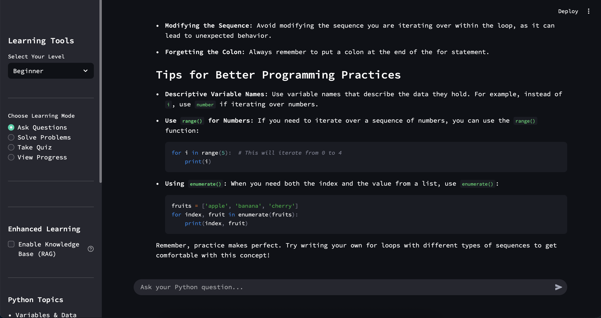
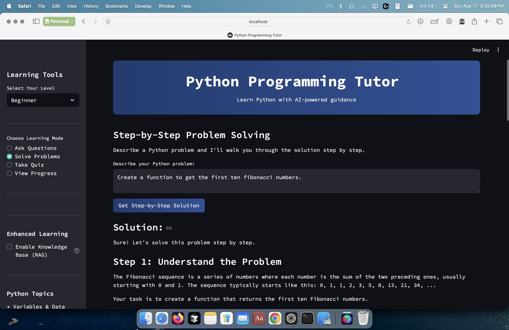
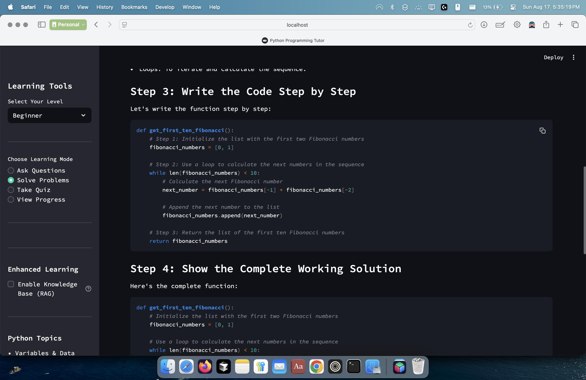
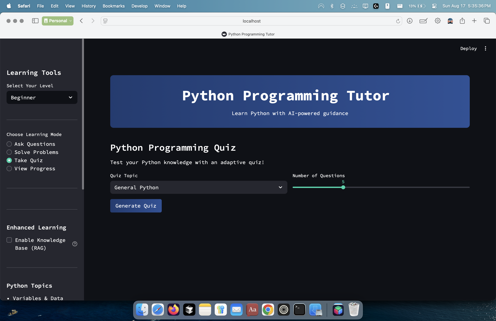
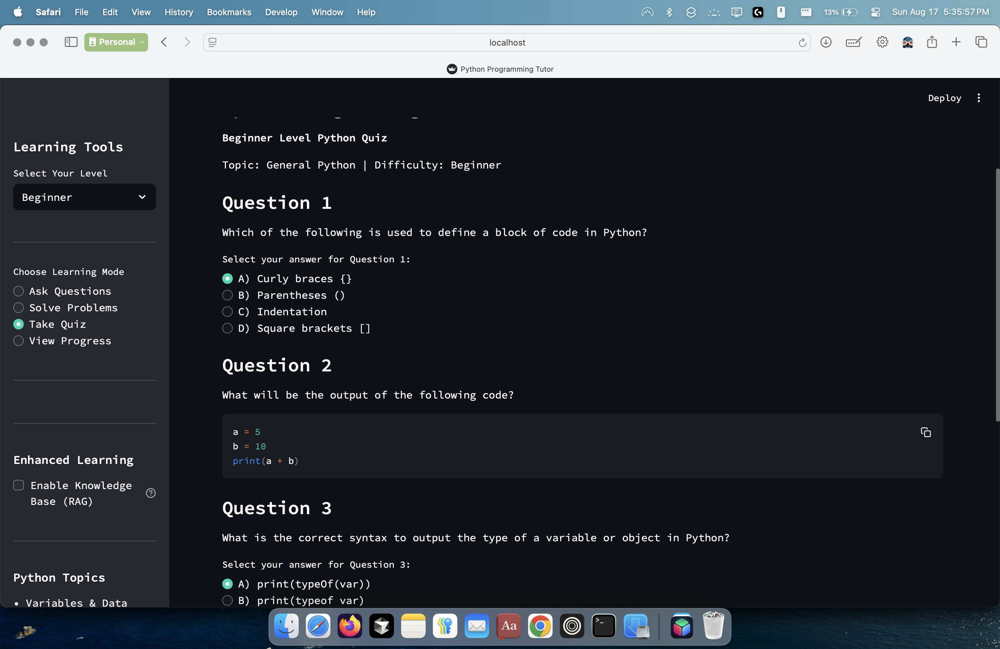

# Python Programming Tutor

An AI-powered Python programming tutor built with Streamlit and OpenAI GPT-4o. The application provides interactive learning through multiple modes: Q&A chat, step-by-step problem solving, adaptive quizzes, and progress tracking.

## Features

- **Ask Questions**: Interactive chat with AI tutor for Python programming questions




- **Solve Problems**: Step-by-step solutions for Python programming challenges




- **Take Quiz**: AI-generated adaptive quizzes with multiple topics and difficulty levels





- **View Progress**: Comprehensive analytics including performance history and score trends
- **Enhanced Learning (RAG)**: Optional knowledge base integration for more detailed, context-aware responses

## Running Locally

### Prerequisites

- Python 3.11 or higher
- OpenAI API key (get one from https://openai.com/api/)

### Installation

1. **Install Core Dependencies**
   ```bash
   pip install streamlit openai
   ```

2. **Optional: Install RAG Dependencies (for enhanced learning)**
   ```bash
   pip install sentence-transformers faiss-cpu
   ```
   
   *Note: RAG functionality allows you to upload your own study materials for more personalized responses. The app works perfectly without these packages in simple mode.*

3. **Set Up OpenAI API Key**
   
   Set your OpenAI API key as an environment variable:
   
   **On Windows:**
   ```bash
   set OPENAI_API_KEY=your_api_key_here
   ```
   
   **On Mac/Linux:**
   ```bash
   export OPENAI_API_KEY=your_api_key_here
   ```

4. **Download Project Files**
   
   Make sure you have these files in your project directory:
   - `app.py` (main application)
   - `python_tutor.py` (AI tutor logic)
   - `python_quiz_generator.py` (quiz generation)
   - `hybrid_tutor.py` (RAG-enhanced tutor, optional)
   - `document_processor.py` (document processing for RAG, optional)

5. **Run the Application**
   ```bash
   streamlit run app.py --server.port 5000
   ```

   The app will start and open in your browser at `http://localhost:5000`.

### Optional: Server Configuration

For exact server settings, create a `.streamlit/config.toml` file:

```toml
[server]
headless = true
address = "0.0.0.0"
port = 5000
```

## Usage

1. **Select Your Level**: Choose Beginner, Intermediate, or Advanced
2. **Choose Learning Mode**: 
   - Ask Questions for interactive Q&A
   - Solve Problems for step-by-step solutions
   - Take Quiz for adaptive testing
   - View Progress for learning analytics
3. **Optional: Enable Enhanced Learning**:
   - Check "Enable Knowledge Base (RAG)" in the sidebar
   - Upload your Python study materials (PDF, TXT, MD files)
   - Get more detailed, context-aware responses based on your materials
4. **Start Learning**: Interact with the AI tutor to improve your Python skills

## Requirements

### Core Requirements
- Python 3.11 or higher
- Active internet connection for OpenAI API calls
- Valid OpenAI API key with available credits

### Optional for Enhanced Learning (RAG)
- sentence-transformers package
- faiss-cpu package
- Study materials in PDF, TXT, or Markdown format

## Topics Covered

- Variables & Data Types
- Control Flow (if/else)
- Loops (for/while)
- Functions
- Lists & Arrays
- Dictionaries
- Strings
- File Handling
- Error Handling
- Object-Oriented Programming
- Modules & Packages

